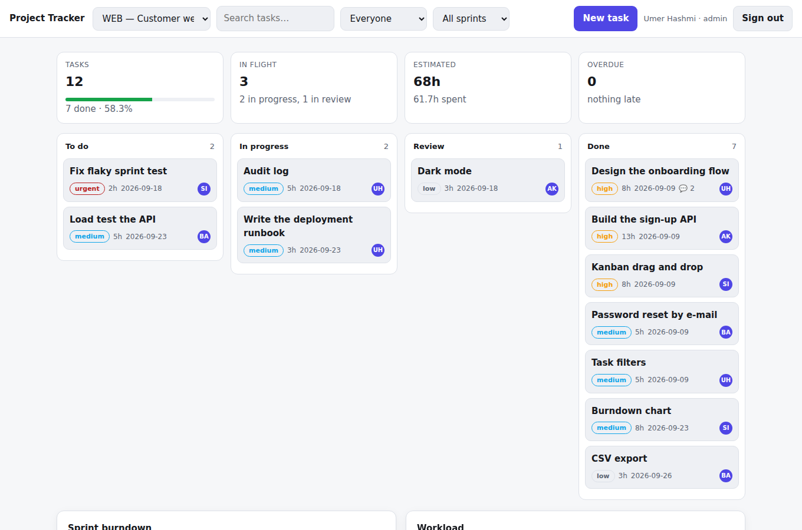
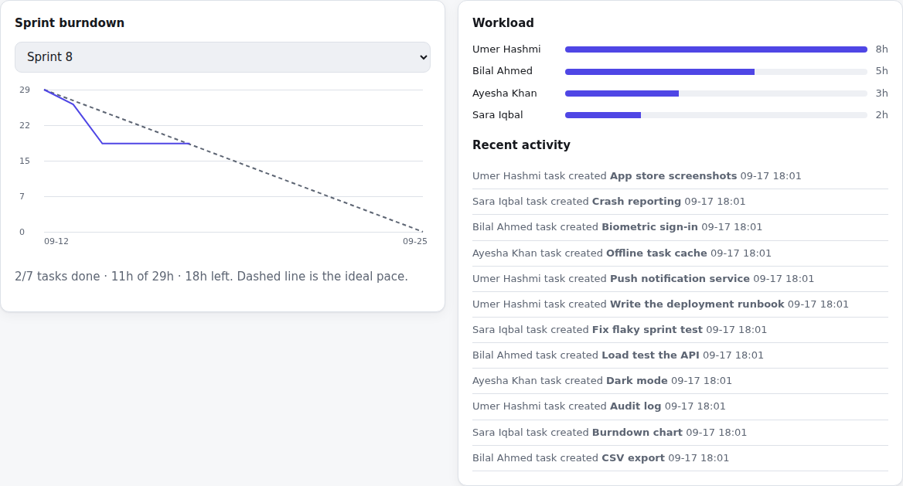

# Project Tracker

**Live demo:** https://umer-78.github.io/project-tracker/

[](https://github.com/umer-78/project-tracker/actions/workflows/ci.yml)


A team project management tool: **projects, sprints, a drag-and-drop kanban
board, workload, burndown and an audit trail**. FastAPI and SQLite on the back,
a framework-free board on the front, with roles, token auth and tests.




## Features

**Board**
- Four columns (to do, in progress, review, done) with drag and drop, and arrow
  keys for anyone not using a mouse
- Priority, estimate, due date, assignee initials and comment count on each card
- Overdue tasks are marked, not merely sorted
- Filter by assignee, sprint, or free text; the board updates as you type
- Optimistic moves: the card moves at once and reconciles with the server

**Planning and reporting**
- Sprints with goals and dates
- **Burndown** with the ideal line and the actual line — and the actual line
  stops at today, instead of pretending to know the future
- **Workload** per person in open hours, including people with nothing assigned,
  so gaps show as clearly as overload
- Project summary: completion, hours estimated against spent, overdue list
- Weekly **throughput**, the honest basis for a forecast
- CSV export and an activity feed of who changed what

**Behind the scenes**
- Roles: `admin` (everything), `member` (read and write), `viewer` (read only)
- Bearer tokens with an expiry; passwords hashed with `hashlib.scrypt` and
  compared with `hmac.compare_digest`
- SQLite with foreign keys **on**, `CHECK` constraints on every enum column and
  indexes on the columns the board actually queries
- `completed_at` is maintained by the API, so reopening a task clears it and the
  burndown stays honest

## Quick start

```bash
git clone https://github.com/umer-78/project-tracker.git
cd project-tracker
python -m venv .venv && source .venv/bin/activate
pip install -e ".[dev]"

tracker --db demo.db demo      # two projects, two sprints, five people
tracker --db demo.db serve     # http://127.0.0.1:8000
```

Sign in as `umer@example.com` / `password123` (admin). Other demo accounts:
`ayesha@`, `bilal@`, `sara@` (members) and `client@example.com` (viewer, to see
the read-only role).

API documentation is generated at `/docs`.

## From the command line

```text
$ tracker --db demo.db report 1
WEB — Customer web app (active)
  7/12 tasks done (58.3%)
  todo 2   in progress 2   review 1
  estimated 68.0h, spent 61.7h

  workload:
    Umer Hashmi       2 open     8.0h  overdue 0
    Bilal Ahmed       1 open     5.0h  overdue 0
    Ayesha Khan       1 open     3.0h  overdue 0
    Sara Iqbal        1 open     2.0h  overdue 0
```

## API

| Method | Path | Notes |
|---|---|---|
| `POST` | `/api/login` `/api/logout` | bearer token, 14-day expiry |
| `GET`/`POST` | `/api/projects` | filter by status |
| `GET`/`POST` | `/api/projects/{id}/sprints` | |
| `GET`/`POST` | `/api/projects/{id}/tasks` | filters: `status`, `assignee_id`, `sprint_id`, `q`, `overdue` |
| `GET`/`PATCH`/`DELETE` | `/api/tasks/{id}` | detail includes comments and activity |
| `POST` | `/api/tasks/{id}/comments` | |
| `GET` | `/api/sprints/{id}/burndown` | ideal and actual series |
| `GET` | `/api/workload` | open hours per person |
| `GET` | `/api/projects/{id}/summary` · `/throughput` · `/export.csv` | |
| `GET` | `/api/activity` | audit trail |

## Tests

```bash
ruff check .
python -m pytest -q     # 21 tests
```

They cover password hashing and token expiry, that viewers cannot write and only
admins create users, foreign keys and `CHECK` constraints, the task lifecycle
including `completed_at` being cleared on reopen, filters and search ordering,
burndown shape (and that the actual line stops at today), workload including
people with nothing open, CSV export and the seed data. CI also boots the app
and calls it over HTTP.

## Design notes

- **No ORM.** The schema is small and the queries are the interesting part.
  Everything is parameterised; nothing is string-formatted into SQL.
- **The project filter lives in the `JOIN`, not the `WHERE`.** Put it in the
  `WHERE` clause and a person with no tasks in that project vanishes from the
  workload report instead of showing as free capacity.
- **`[hidden]` is `display: none !important`** in the CSS: the sign-in screen sets
  `display: grid`, which otherwise wins and leaves it covering the board.

## Not included

Real-time updates (the board reloads on change rather than using websockets),
file attachments, e-mail notifications and per-project permissions. The auth is
deliberately simple — for anything public-facing, put it behind a real identity
provider.

## License

[MIT](LICENSE)
